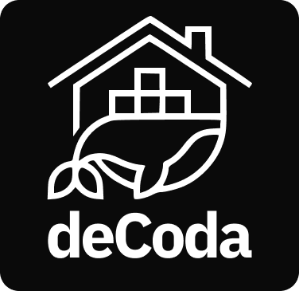

_decoda_ is the _core_ of my homelab side project.

This repository contains information about the side-projects I am working on locally,
the infrastructure I am using to host them, and also other self-hosted tools and apps.

### Hardware and OS

I am using a Ugreen Dxp2800 with 8 GB of RAM + 4 TB HDD (in mirrored setup) + 500 GB SSD, with the default Ugreen OS (UGOS Pro).

### Self-hosted apps

#### 💸 [Coda Finances](https://github.com/marlonseben1/coda-finances)

<small>— my own web app to manage my personal finances and spending, built with React and Laravel</small>

#### 📸 [Immich](https://immich.app/)

<small>— self-hosted photo and video backup solution</small>

#### 📨 [Paperless-ngx](https://docs.paperless-ngx.com/)

<small>— self-hosted document management system</small>

### Ideas for the future

- Creating an internal component library
